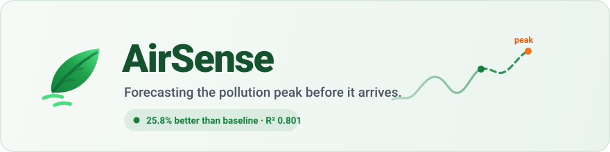

<div align="center">



[](https://airsense-526660427489.asia-south1.run.app)
[](https://www.python.org/)
[](https://fastapi.tiangolo.com/)
[](https://scikit-learn.org/)

** [Open the live app](https://airsense-526660427489.asia-south1.run.app)** &nbsp;·&nbsp; **[API docs](https://airsense-526660427489.asia-south1.run.app/docs)**

*Built by **Amaan Khan** and **Srishti Rathi** · MAIT, Delhi · 1M1B Portfolio Submission*

</div>

---

> **25.8 % more accurate than the standard naive baseline**, validated on a held-out
> chronological test set of 396 hours the model never saw during training.

Government monitoring stations tell you the air is bad **now**, city-wide.
AirSense predicts the NOx peak **1–6 hours before it arrives**, at a specific
location, and attaches a concrete action you can take about it.

---

##  Table of contents

- [The insight](#-the-insight)
- [What it does](#-what-it-does)
- [The six screens](#-the-six-screens)
- [Validation — the differentiator](#-validation--the-differentiator)
- [No data leakage](#-no-data-leakage)
- [Architecture](#-architecture)
- [Data and cleaning](#-data-and-cleaning)
- [API reference](#-api-reference)
- [Running locally](#-running-locally)
- [Deployment](#-deployment)
- [Design decisions](#-design-decisions)
- [Limitations and honesty notes](#-limitations-and-honesty-notes)
- [Roadmap](#-roadmap)
- [Credits](#-credits)

---

##  The insight

Analysis of 2 000 hourly readings found NOx averaging **175.1 ppb in the 6–9 PM
window** against **53.3 ppb overnight (3–6 AM)** — a **3.3× swing** that tracks
traffic.

> **Pollution is not random. It is a predictable daily cycle — and predictability
> is exactly what makes forecasting viable.**

That ratio is **computed live** by `train.py` into `models/metrics.json` and
rendered straight from the API. It is never hardcoded in the UI, so it can never
drift away from the data behind it.

---

##  What it does

| | | |
|:--:|---|---|
|  | **Reads now** | Current NOx with a risk band and the action to take right now |
|  | **Forecasts ahead** | 1–6 hours out, using a gradient-boosting model on lagged features |
|  | **Warns early** | *"Peak predicted in N hours — act now"* when an upcoming hour turns High or Severe |
|  | **Proves itself** | Backtests every prediction against what actually happened, in the UI |
|  | **Replays honestly** | Position "now" anywhere in the dataset; forecasts recompute from that hour only |
|  | **Exports** | Download any forecast as CSV, with provenance headers attached |

---

##  The six screens

| Screen | What it shows |
|---|---|
| **Dashboard** | Hero reading, risk band, recommended action, and the 6-hour forecast strip with the alert banner |
| **Forecast** | Measured 48 h joined to the 6 h prediction on one chart, plus an hour-by-hour table and CSV export |
| **Data Explorer** | The daily pollution cycle that the whole thesis rests on, and the full cleaning summary |
| **Model Performance** | Validation metrics, the **backtest** (predicted vs actual across 396 held-out hours), and feature importance |
| **Campus Zones** | Four zones derived from one sensor — labelled *simulated* on the section **and every card** |
| **Method & Limits** | Risk-band table, data citation, and every limitation stated plainly |

The replay position lives in the URL, so a link reproduces exactly what the
sender was looking at:
`…/#/dashboard?as_of=2004-06-23T06:00:00`

<!-- To add screenshots: capture each screen, save to docs/img/, then embed:
      -->

---

##  Validation — the differentiator

Held-out **chronological** test set. A shuffled split would leak the future into
training and produce a fraudulently good score.

| Metric | AirSense | Persistence baseline | |
|---|---:|---:|---|
| **MAE** | **25.92 ppb** | 34.94 ppb |  **−25.8 %** |
| **RMSE** | **37.02 ppb** | 51.34 ppb |  −27.9 % |
| **R²** | **0.801** | — | |

**Backtest across all 396 test hours** (`GET /api/backtest`, rendered as a chart
in the app):

| | |
|---|---|
| Median absolute error | **17.52 ppb** |
| Hours predicted within 25 ppb | **61.6 %** |
| Hours predicted within 50 ppb | **86.4 %** |
| Worst single-hour error | 166.3 ppb |

###  Early-warning skill — the operational question

Average error is not what matters to someone deciding whether to move a class
indoors. What matters is: **when the air actually went bad, did we say so
beforehand?**

Of the **72 hours** in the test period that genuinely exceeded 200 ppb (High):

| | |
|---|---:|
| Flagged **one hour in advance** | **52 of 72** |
| **Recall** — actual High hours caught | **72.2 %** |
| **Precision** — warnings that were correct | **77.6 %** |
| Missed | 20 |
| False alarms | 15 |

Measured on the held-out test set, never on training data. Both the misses and
the false alarms are reported — a warning system that hid either would not be
worth trusting.

- **Train:** 1 580 rows · 12 Mar 2004 18:00 → 2 Jun 2004 22:00
- **Test:** 396 rows · 2 Jun 2004 23:00 → 23 Jun 2004 12:00
- **Model:** `GradientBoostingRegressor(n_estimators=300, max_depth=4, learning_rate=0.05, random_state=42)`

**Why "persistence" as the baseline?** It predicts that the next hour equals the
current hour. For an hourly series that is the honest naive benchmark — if a model
cannot beat it, it has not learned anything worth deploying.

---

##  No data leakage

**Every feature must be knowable *before* the hour being predicted.**

CO and NOx correlate at **0.94** in this dataset — measured in `train.py`, not
assumed. Feeding same-hour CO, benzene or NO₂ into the model would be
*nowcasting* dressed up as forecasting, and would inflate the score
substantially. So co-pollutants and weather are **lagged by one hour**.

```python
FEATURES = ['nox_lag_1','nox_lag_2','nox_lag_3','nox_lag_24',
            'nox_roll_3','nox_roll_24','hour_sin','hour_cos',
            'co_lag_1','benzene_lag_1','no2_lag_1','temp_lag_1','humidity_lag_1']
```

`app/features.py` is imported by **both** `train.py` and the server, so the
feature computation is structurally incapable of drifting between training and
serving.

The honest answer to *"what did the model know at prediction time?"* is
**"only the past."**

---

##  Architecture

```
              UCI hourly CSV  (raw, 7 394 rows)
                        │
                        ▼
          ┌─────────────────────────────┐
          │   train.py     (OFFLINE)    │  run locally, never at request time
          │   clean → features →        │
          │   chronological split →     │
          │   GBM → validate            │
          └──────────────┬──────────────┘
                         │  commits three artefacts
          ┌──────────────┼──────────────┐
          ▼              ▼              ▼
   data/air_       models/          models/
   quality.csv     forecaster.pkl   metrics.json
          └──────────────┼──────────────┘
                         ▼
          ┌─────────────────────────────┐
          │  FastAPI  (app/main.py)     │  ONE Cloud Run service
          │  /api/*   JSON              │
          │  /        static SPA        │
          └──────────────┬──────────────┘
                         ▼
     Sidebar dashboard · Tailwind + Chart.js via CDN · no build step
```

**Flow:** Data → Cleaning → Features → Model → Forecast → Action

```
airsense/
├── train.py                 # offline: clean, train, validate, write artefacts
├── app/
│   ├── features.py          # shared by train AND serve — no skew possible
│   ├── forecast.py          # recursive multi-step prediction
│   ├── risk.py              # risk banding + recommended actions
│   ├── zones.py             # simulated campus zones (flagged)
│   ├── main.py              # FastAPI routes + static mount + backtest
│   └── static/              # index.html · app.js · styles.css · logo.svg
├── data/air_quality.csv     # committed
├── models/forecaster.pkl    # committed
├── models/metrics.json      # committed
├── Dockerfile
├── requirements.txt         # pinned to the versions that trained the model
├── DESIGN.md                # full UI specification
├── docs/VIDEO_SCRIPT.md     # 60-second demo script
└── README.md
```

---

##  Data and cleaning

**Source:** UCI Air Quality Data Set — De Vito, S., Massera, E., Piga, M.,
Martinotto, L., & Di Francia, G. (2008). *On field calibration of an electronic
nose for benzene estimation in an urban pollution monitoring scenario.*
Sensors and Actuators B: Chemical, 129(2), 750–757.

A contiguous 2 000-row hourly slice is used (11 Mar – 23 Jun 2004).

**Cleaning steps**

1. Replace the `-200` sensor-failure sentinel with `NaN`
2. Drop rows where the target (`nox`) is missing
3. Forward-fill, then median-fill, remaining feature gaps
4. Drop exact duplicate timestamps
5. Sort by datetime ascending

**Result — reported exactly as measured:**

| | |
|---|---:|
| Rows in / out | 2 000 / 2 000 |
| Sentinels replaced | **0** |
| Nulls filled | 0 |
| Duplicates removed | 0 |
| Non-hourly gaps | 63 |

> The mirror used here was **already cleaned upstream**, so the sentinel pass
> found nothing to replace. The guard stays in the code because a raw UCI file
> contains thousands of `-200` values. We are not claiming credit for removing
> sentinels that were never there.

---

##  API reference

All endpoints return JSON. Interactive docs at [`/docs`](https://airsense-526660427489.asia-south1.run.app/docs).

| Endpoint | Returns |
|---|---|
| `GET /api/health` | Service status and row count |
| `GET /api/current` | Reading at the replay position + risk band + action |
| `GET /api/history?hours=48` | Recent hourly readings |
| `GET /api/forecast?horizon=6` | t+1…t+6 predictions, alert, stated assumptions |
| `GET /api/backtest` | Predicted vs actual vs baseline across all 396 test hours |
| `GET /api/metrics` | Full validation results from the training run |
| `GET /api/zones` | Campus zones — always flagged `"simulated": true` |
| `GET /api/daily-profile` | Mean NOx per hour-of-day + the live-computed ratio |
| `GET /api/risk-bands` | Band thresholds, so the UI hardcodes nothing |
| `GET /api/replay` | Dataset bounds and curated replay bookmarks |

Every data endpoint accepts **`?as_of=<ISO timestamp>`**. Only data up to that
hour is used, so a forecast issued from an earlier vantage point is structurally
unable to consult later readings.

```bash
curl "https://airsense-526660427489.asia-south1.run.app/api/forecast?as_of=2004-06-23T06:00:00"
```

---

##  Running locally

```bash
pip install -r requirements.txt
python train.py                    # writes data/ and models/ artefacts
uvicorn app.main:app --reload      # http://127.0.0.1:8000
```

`train.py` must run before the server — **the server loads artefacts and never
trains.** Training at startup would blow Cloud Run's container-start budget.

Expected training output:

```
model     MAE   25.92   RMSE   37.02   R2 0.801
baseline  MAE   34.94   RMSE   51.34   (persistence)
improvement over baseline: 25.8%
train 1580 rows / test 396 rows
peak insight: evening 175 ppb vs overnight 53 ppb = 3.3x
```

`train.py` fails loudly rather than silently if something looks wrong — it asserts
the date-column order, asserts the test set starts strictly after the training set
ends, and warns if R² climbs above 0.90 (a leakage smell).

---

##  Deployment

```bash
gcloud run deploy airsense --source . --region asia-south1 \
  --allow-unauthenticated --memory 1Gi --timeout 300 --max-instances 3
```

- `--allow-unauthenticated` so the link opens without a Google login
- `--max-instances 3` caps spend
- `asia-south1` (Mumbai) for lowest latency during an India demo

**Base-image note.** The container uses `python:3.14-slim`, not `python:3.11-slim`.
pandas 3.0.2 — the version that trained the model — publishes no cp311 wheel, so
a 3.11 base cannot install the training environment. Matching that environment
matters more than the base-image version, because a scikit-learn version mismatch
can silently corrupt an unpickled model. `requirements.txt` is pinned to the exact
versions recorded under `trained_with` in `models/metrics.json`, and the Dockerfile
asserts the artefacts exist at build time rather than failing at deploy time.

---

##  Design decisions

<details>
<summary><b>Why gradient boosting and not an LSTM?</b></summary><br>

Small dataset (~2 000 rows), tabular lagged features, trains in seconds, and the
feature importances are directly inspectable. An LSTM would add training time,
tuning burden and opacity without evidence it would help at this scale. This is a
deliberate engineering trade-off, not a limitation being hidden.
</details>

<details>
<summary><b>Why is there no database?</b></summary><br>

The dataset is static and ships with the repo as a CSV. A database would add a
network dependency, a failure mode on demo day, and cost — in exchange for
nothing.
</details>

<details>
<summary><b>Why no frontend build step?</b></summary><br>

Tailwind and Chart.js load from CDNs and the app is plain HTML/CSS/JS. No npm, no
bundler, no build cache — which removes an entire class of deployment failures.
The trade-off is that the page needs internet access for styling; see
[Limitations](#-limitations-and-honesty-notes).
</details>

<details>
<summary><b>Why can you move "now" around the dataset?</b></summary><br>

Because this is a historical series, "now" is a position we choose. Making that
choice explicit and visible is more honest than silently pinning to the last row.
Of 1 952 possible vantage points, **586 forecast a High or Severe hour within 6
hours** — the final row simply happens to be a flat one. Choosing the vantage
point does not change the model or the prediction.
</details>

---

##  Limitations and honesty notes

Stating known limits precisely is what separates an engineering submission from a
sales pitch. These are real.

1. **Single sensor stream — the four campus zones are simulated.** We have one
   sensor, not four. Each zone applies a fixed, documented multiplier (Main Gate
   ×1.25, Parking ×1.15, Central Lawn ×0.90, Library ×0.80) to the one real
   measured value. The API returns `"simulated": true` and the UI prints
   *"simulated zone offset — single sensor stream"* on the section **and on every
   card**. These are not four independent sensors.

2. **Historical dataset, not a live feed.** The data is hourly readings from 2004.
   Every screen says so, and the UI never shows a bare time without the words
   *"Dataset time"*.

3. **Exogenous features are held constant in the recursive forecast.** Temperature,
   humidity and co-pollutants stay at their last observed values — we have no
   weather forecast, and inventing one would be fabricating input. From t+2 the
   NOx lags are fed by the model's *own* predictions, so **error compounds with
   horizon**. The UI labels t+1 `measured inputs` and t+2…t+6 `model-fed inputs`.

4. **Risk bands are project-defined, not official.** Low `<100`, Moderate
   `100–200`, High `200–300`, Severe `>300` ppb are operational thresholds chosen
   for this demonstration. They are **not** CPCB or WHO AQI categories and are
   never labelled as such.

5. **Lag features are positional, not time-aware.** 63 of the 2 000 intervals are
   not exactly one hour, so `nox_lag_1` occasionally spans a gap rather than a true
   single hour — roughly 3 % of rows.

6. **The cleaning pass found 0 sentinels** because this source was pre-cleaned
   upstream. See [Data and cleaning](#-data-and-cleaning).

7. **Replay bookmarks are curated** — chosen at hours where the model does forecast
   a peak, so the alert banner can be demonstrated.

8. **The frontend depends on two CDNs** (Tailwind, Chart.js). Without internet the
   page loads but is unstyled and chartless.

---

##  Roadmap

| Phase | Milestone |
|---|---|
| **Pilot** | Real low-cost NOx sensor deployed at MAIT; replace the historical CSV with a live feed |
| **Multi-zone** | Additional sensors turn the four simulated zones into four measured ones |
| **Forecast quality** | Ingest a weather forecast so exogenous features stop being held constant — the single biggest accuracy win available |
| **Alerting** | Opt-in notifications ahead of predicted Severe hours |
| **Scale** | Multi-campus tenancy and a public API |

---

##  Credits

**Team** — Amaan Khan · Srishti Rathi · MAIT, Delhi

**Stack** — Python · scikit-learn · pandas · FastAPI · Chart.js · Tailwind CSS ·
Docker · Google Cloud Run

**Data** — UCI Machine Learning Repository, De Vito et al. (2008), cited above.

**AI tools used** — Claude Code was used to build this, and scikit-learn provides
the model. Being upfront about that is the point: what matters is that we
understand and can defend every part of the result.

---

<div align="center">

** [Open the live app](https://airsense-526660427489.asia-south1.run.app)**

*AirSense turns air quality from something you react to into something you plan around.*

</div>
